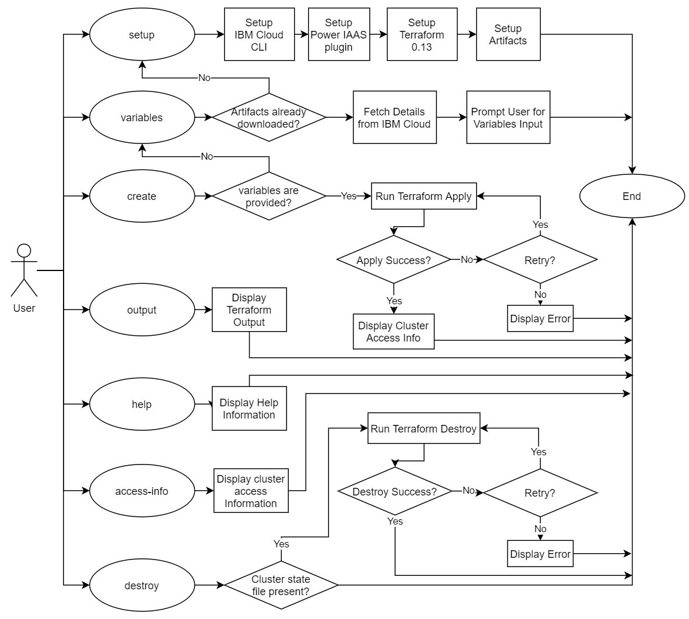

# Install OpenShift on PowerVS

- [Install OpenShift on PowerVS](#install-openshift-on-powervs)
  - [Introduction](#introduction)
  - [Features](#features)
  - [Supported Platforms](#supported-platforms)
    - [MacOS](#macos)
    - [Linux (x86_64/ppc64le)](#linux-x86_64ppc64le)
    - [Windows 10 (64-bit)](#windows-10-64-bit)
  - [Firewall Requirements](#firewall-requirements)
  - [Usage](#usage)
  - [Prerequisites](#prerequisites)
  - [Quickstart](#quickstart)
  - [Advanced Usage](#advanced-usage)
    - [Different OpenShift Versions](#different-openshift-versions)
    - [Non-interactive mode](#non-interactive-mode)
  - [Tutorials](#tutorials)
  - [Detailed Explanation of the Core Commands](#detailed-explanation-of-the-core-commands)
    - [setup](#setup)
    - [variables](#variables)
    - [create](#create)
    - [destroy](#destroy)
  - [Contributing](#contributing)

## Introduction

This project contains a bash script to help you deploy OpenShift Container Platform 4.X on [IBM® Power Systems™ Virtual Server on IBM Cloud](https://www.ibm.com/cloud/power-virtual-server) (PowerVS). The Terraform code at [ocp4-upi-powervs](https://github.com/ocp-power-automation/ocp4-upi-powervs/) is used for the deployment process.

This project also contains a folder powervs-ipi-scripts containing some automation scripts related to [PowerVS installation using IPI](https://github.com/ocp-power-automation/openshift-install-power/tree/devel/powervs-ipi-scripts).

Ensure your PowerVS instance is prepped for deploying OpenShift Clusters. Please check this [link](https://ocp-power-automation.github.io/ocp4-upi-powervs/docs/ocp_prereqs_powervs/) for more details

Here is [quick demo](https://asciinema.org/a/380928).
## Features

* Simple script based installer to deploy OpenShift (4.5 onwards) cluster on PowerVS leveraging Infrastructure as Code (IaC) pattern
* Supports multiple platforms including Linux(x86_64/ppc64le), Windows & Mac OSX
* Sets up the latest IBM Cloud CLI with Power Virtual Servers plugin.
* Sets up the latest Terraform binary
* Provides interactive mode to populate required Terraform variables
* Abstract out the Terraform lifecycle management

## Supported Platforms

Only 64bit Operating Systems are supported by the script.

The script requires `bash` shell and a package manager pre-configured.

### MacOS

Catalina (10.15) and above is required.

The script uses [Homebrew](https://brew.sh/) package manager to install required packages.

### Linux (x86_64/ppc64le)

RHEL8/CentOS8 and above or Ubuntu 16.04 and above is required.

The script uses the default package manager (`yum/dnf/apt`) based on the distribution.

### Windows 10 (64-bit)

The script can run on GitBash, Windows Subsystem for Linux and Cygwin terminals.

If using Cygwin, then please ensure `curl` and `unzip` packages are installed. You will need to run the Cygwin setup again.

Note: **PowerShell is Unsupported**.

## Firewall Requirements

1. Ensure inbound access is allowed for the following TCP ports.
This is only required when using a Cloud instance or a remote VM so that you can connect to it using SSH and run the installer
   - 22 (SSH)
2. Ensure **outbound** access is allowed for the following TCP ports
   - 80 (HTTP)
   - 443 (HTTPS)
   - 6443 (OC CLI)

## Usage

1. Create an install directory where all the configurations, logs and data files will be stored.
```
$ mkdir ocp-install-dir && cd ocp-install-dir
```
2. Download the script on your system and change the permission to execute.
```
$ curl -sL https://raw.githubusercontent.com/ocp-power-automation/openshift-install-power/main/openshift-install-powervs -o ./openshift-install-powervs
$ chmod +x ./openshift-install-powervs
```
3. Run the script.
```
$ ./openshift-install-powervs

Automation for deploying OpenShift 4.X on PowerVS

Usage:
  openshift-install-powervs [command] [<args> [<value>]]

Available commands:
  setup           Install all the required packages/binaries in current directory
  variables       Interactive way to populate the variables file
  create          Create an OpenShift cluster
  destroy         Destroy an OpenShift cluster
  output          Display the cluster information. Runs terraform output [NAME]
  access-info     Display the access information of installed OpenShift cluster
  help            Display this information

Where <args>:
  -var               Terraform variable to be passed to the create/destroy command
  -var-file          Terraform variable file name in current directory. (By default using var.tfvars)
  -flavor            Cluster compute template to use eg: small, medium, large
  -force-destroy     Not ask for confirmation during destroy command
  -ignore-os-checks  Ignore operating system related checks
  -ignore-warnings   Warning messages will not be displayed. Should be specified first, before any other args.
  -verbose           Enable verbose for terraform console messages
  -all-images        List all the images available during variables prompt
  -trace             Enable tracing of all executed commands
  -version, -v       Display the script version

Environment Variables:
  IBMCLOUD_API_KEY    IBM Cloud API key
  RELEASE_VER         OpenShift release version (Default: 4.13)
  ARTIFACTS_VERSION   Tag or Branch name of ocp4-upi-powervs repository (Default: main)
  RHEL_SUBS_PASSWORD  RHEL subscription password if not provided in variables
  NO_OF_RETRY         Number of retries/attempts to run repeatable actions such as create (Default: 5)

Submit issues at: https://github.com/ocp-power-automation/openshift-install-power/issues

```

**Using the Container Image**

To use the images present in the [quay.io/powercloud](https://quay.io/repository/powercloud/openshift-install-powervs?tab=tags) repository, run the following command.

```
docker run -it -e IBMCLOUD_API_KEY="<key>" -v $(pwd):/data quay.io/powercloud/openshift-install-powervs:<valid-tag> create
```
OR

```
podman run -it -e IBMCLOUD_API_KEY="<key>" -v $(pwd):/data quay.io/powercloud/openshift-install-powervs:<valid-tag> create
```
Tags provide information about the release version, ocp version or supported architecture.

In case you need to build the openshift-install-powervs image, check out the following ["Usage with Containers"](https://github.com/ocp-power-automation/openshift-install-power/blob/devel/docs/container.md) link

## Prerequisites

**The script assumes PowerVS prerequisites for OpenShift are already in place.**

In case you missed, here is the link to the [prerequisites](https://github.com/ocp-power-automation/ocp4-upi-powervs/blob/main/docs/ocp_prereqs_powervs.md)


For running the script you need the following:
1. **IBM Cloud API key**: Create the key by following the instructions available in the following [link](https://cloud.ibm.com/docs/account?topic=account-userapikey)
2. **OpenShift Pull secret**: Download the secret from the following [link](https://cloud.redhat.com/openshift/install/power/user-provisioned).
You'll need to place the file in the install directory and name it as **pull-secret.txt**
3. **RHEL Subscription ID and Password**.


## Quickstart

1. Export the IBM Cloud API Key and RHEL Subscription Password.
    ```
    $ set +o history
    $ export IBMCLOUD_API_KEY='<your API key>'
    $ export RHEL_SUBS_PASSWORD='<your RHEL subscription password>'
    $ set -o history
    ```

2. Run the `create` command.
    ```
    $ ./openshift-install-powervs create
    ```

    The script will setup the required tools and run in interactive mode prompting for inputs.

    Once the above command completes successfully it will print the cluster access information.
    ```
    Login to bastion: 'ssh -i automation/data/id_rsa root@145.48.43.53' and start using the 'oc' command.
    To access the cluster on local system when using 'oc' run: 'export KUBECONFIG=/root/ocp-install-dir/automation/kubeconfig'
    Access the OpenShift web-console here: https://console-openshift-console.apps.test-ocp-6f2c.ibm.com
    Login to the console with user: "kubeadmin", and password: "MHvmI-z5nY8-CBFKF-hmCDJ"
    Add the line on local system 'hosts' file:
    145.48.43.53 api.test-ocp-6f2c.ibm.com console-openshift-console.apps.test-ocp-6f2c.ibm.com integrated-oauth-server-openshift-authentication.apps.test-ocp-6f2c.ibm.com oauth-openshift.apps.test-ocp-6f2c.ibm.com prometheus-k8s-openshift-monitoring.apps.test-ocp-6f2c.ibm.com grafana-openshift-monitoring.apps.test-ocp-6f2c.ibm.com example.apps.test-ocp-6f2c.ibm.com

    ```

## Advanced Usage

Before running the script, you may choose to override some environment variables as per your requirement.

### Different OpenShift Versions


By default OpenShift version 4.13 is installed.

If you want to install 4.11, then export the variable `RELEASE_VER`.
```
$ export RELEASE_VER="4.11"
```

### Non-interactive mode

You can avoid the interactive mode by having the required input files available in the install directory

**Required input files**
1. Terraform vars file (filename: `var.tfvars`)
2. SSH key files (filename: `id_rsa` & `id_rsa.pub`)

    Example `var.tfvars` file
    ```
    ibmcloud_region = "syd"
    ibmcloud_zone = "syd04"
    service_instance_id = "123456abc-xzz-2223434343"
    rhel_image_name = "rhel-83-12062022"
    rhcos_image_name = "rhcos-413-01062023"
    network_name = "ocp-net"
    openshift_install_tarball = "https://mirror.openshift.com/pub/openshift-v4/ppc64le/clients/ocp/stable-4.13/openshift-install-linux.tar.gz"
    openshift_client_tarball = "https://mirror.openshift.com/pub/openshift-v4/ppc64le/clients/ocp/stable-4.13/openshift-client-linux.tar.gz"
    cluster_id_prefix = "test-ocp"
    cluster_domain = "xip.io"
    storage_type = "nfs"
    volume_size = "300"
    bastion = {memory = "16", processors = "1", "count" = 1}
    bootstrap = {memory = "32", processors = "0.5", "count" = 1}
    master = {memory = "32", processors = "0.5", "count" = 3}
    worker = {memory = "32", processors = "0.5", "count" = 2}
    rhel_subscription_username = "mysubscription@email.com"
    rhel_subscription_password = "mysubscriptionPassword"
    ```


    You can also pass a custom Terraform variables file using the option `-var-file <filename>` to the script.
    You can also use the option `-var "key=value"` to pass a single variable.
    If the same variable is given more than once then precedence will be from left (low) to right (high).

## Tutorials

Check out the following [learning path](https://developer.ibm.com/series/deploy-ocp-cloud-paks-power-virtual-server/) for deploying and using OpenShift on PowerVS

## Detailed Explanation of the Core Commands

The following core commands are supported by the script.

### [setup](docs/setup.md)
### [variables](docs/variables.md)
### [create](docs/create.md)
### [destroy](docs/destroy.md)

Below is a simple flow chart explaining the flow of each command.



## Contributing

Please see the [contributing doc](CONTRIBUTING.md) for more details.
PRs are most welcome !!
